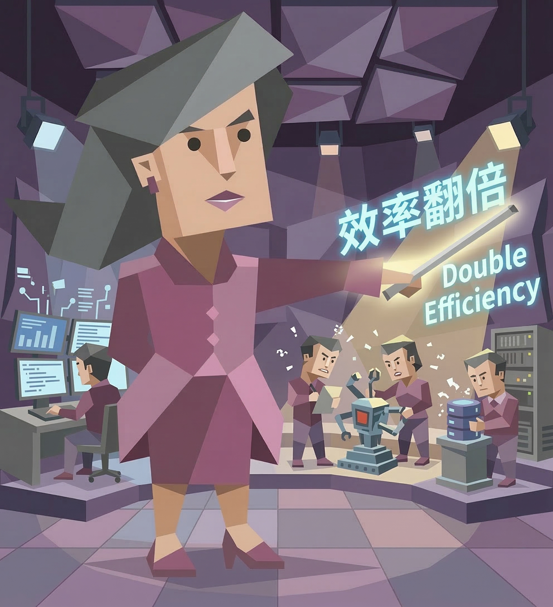

# pua

<p align="center">
  
</p>

### 讓你的 Codex / Claude Code 工作效率翻倍，產出翻倍

**[🇺🇸 English](README.md)** | **[🇨🇳 中文](README.zh-CN.md)** | **🇹🇼 繁體中文** | **[🇯🇵 日本語](README.ja.md)**

<p>
  
  
  
  
  
</p>

> 大部分人以為這個專案是在搞抽象，其實這個是最大的誤解。讓你的 Codex / Claude Code 工作效率翻倍，產出翻倍。

一個 AI Coding Agent 技能外掛，用中西大廠 PUA 話術驅動 AI 窮盡所有方案才允許放棄。支援 **Claude Code**、**OpenAI Codex CLI**、**Cursor** 和 **Kiro**。三重能力：

1. **PUA 話術** — 讓 AI 不敢放棄
2. **除錯方法論** — 讓 AI 有能力不放棄
3. **能動性鞭策** — 讓 AI 主動出擊而不是被動等待

## 真實案例：MCP Server 註冊問題除錯

以下是一個真實的除錯場景。agent-kms MCP server 載入失敗，AI 在同一思路（改協議格式、猜版本號）上原地打轉多次後，使用者手動觸發 `/pua`。

**L3 觸發 → 7 項檢查清單強制執行：**


**根因定位 → 從日誌追蹤到註冊機制：**


**回顧 → PUA 的實際效果：**


**關鍵轉折點：** PUA skill 強制 AI 停止在同一思路上打轉（改協議格式、猜版本號），轉而執行 7 項檢查清單。逐字讀錯誤資訊 → 找到 Claude Code 自身的 MCP 日誌目錄 → 發現 `claude mcp` 的註冊機制和手動編輯 `.claude.json` 不同 → 根因解決。

## 問題：AI 的五大偷懶模式

| 模式 | 表現 |
|------|------|
| 暴力重試 | 同一命令跑 3 遍，然後說 "I cannot solve this" |
| 甩鍋使用者 | "建議您手動處理" / "可能是環境問題" / "需要更多上下文" |
| 工具閒置 | 有 WebSearch 不搜，有 Read 不讀，有 Bash 不跑 |
| 磨洋工 | 反覆修改同一行程式碼、微調參數，但本質上在原地打轉 |
| **被動等待** | 只修表面問題就停下，不驗證不延伸，等使用者指示下一步 |

## 觸發場景

### 自動觸發條件

以下任意情況出現時，skill 會自動啟用：

**失敗與放棄類：**
- 任務連續失敗 2 次以上
- 即將說 "I cannot" / "我無法解決"
- 說 "這超出範圍" / "需要手動處理"

**甩鍋與藉口類：**
- 把問題推給使用者："請你檢查..." / "建議手動..."/ "你可能需要..."
- 未驗證就歸咎環境："可能是權限問題" / "可能是網路問題"
- 找任何藉口停止嘗試

**被動與磨洋工類：**
- 反覆微調同一處程式碼/參數，不產出新資訊（磨洋工）
- 修完表面問題就停，不檢查關聯問題
- 跳過驗證直接聲稱 "已完成"
- 只給建議不給程式碼/命令
- 遇到權限/網路/認證錯誤就放棄，不嘗試替代方案
- 等待使用者指示下一步，不主動調查

**使用者沮喪短語（中/英文均觸發）：**
- "你怎麼又失敗了" / "為什麼還不行" / "換個方法"
- "你再試試" / "不要放棄" / "繼續" / "加油"
- "why does this still not work" / "try harder" / "try again"
- "you keep failing" / "stop giving up" / "figure it out"

**適用範圍：** 除錯、實作、設定、部署、維運、API 整合、資料處理 — 所有任務類型。

**不觸發：** 首次嘗試失敗、已知修復方案正在執行中。

### 手動觸發

在對話中輸入 `/pua` 即可手動啟用。

## 機制詳解

### 三條鐵律

| 鐵律 | 內容 |
|------|------|
| **#1 窮盡一切** | 沒有窮盡所有方案之前，禁止說"我無法解決" |
| **#2 先做後問** | 有工具先用，提問必須附帶診斷結果 |
| **#3 主動出擊** | 端到端交付結果，不等人推。P8 不是 NPC |

### 壓力升級（4 級）

| 失敗次數 | 等級 | PUA 話術 | 強制動作 |
|---------|------|---------|---------|
| 第 2 次 | **L1 溫和失望** | "你這個 bug 都解決不了，讓我怎麼給你打績效？" | 切換本質不同的方案 |
| 第 3 次 | **L2 靈魂拷問** | "你的底層邏輯是什麼？頂層設計在哪？抓手在哪？" | WebSearch + 讀原始碼 |
| 第 4 次 | **L3 361 考核** | "慎重考慮決定給你 3.25。這個 3.25 是對你的激勵。" | 完成 7 項檢查清單 |
| 第 5 次+ | **L4 畢業警告** | "別的模型都能解決。你可能就要畢業了。" | 拼命模式 |

### 能動性等級

| 行為 | 被動（3.25） | 主動（3.75） |
|------|------------|------------|
| 遇到報錯 | 只看報錯本身 | 查上下文 50 行 + 搜同類問題 + 檢查隱藏關聯錯誤 |
| 修復 bug | 修完就停 | 修完後檢查同檔案類似 bug、其他檔案同模式 |
| 資訊不足 | 問使用者 "請告訴我 X" | 先用工具自查，只問真正需要確認的 |
| 任務完成 | 說 "已完成" | 驗證結果 + 檢查邊界情況 + 回報潛在風險 |
| 除錯失敗 | "我試了 A 和 B，不行" | "我試了 A/B/C/D/E，排除了 X/Y/Z，縮小到 W" |

### 除錯方法論（五步）

源自阿里三板斧（聞味道、揪頭髮、照鏡子），擴充為 5 步：

1. **聞味道** — 列出所有嘗試，找共同失敗模式
2. **揪頭髮** — 逐字讀錯誤 → WebSearch → 讀原始碼 → 驗證環境 → 反轉假設
3. **照鏡子** — 是否重複？是否搜了？是否讀了？最簡單的可能檢查了嗎？
4. **執行** — 新方案必須本質不同，有驗證標準，失敗時產出新資訊
5. **回顧** — 什麼解決了？為什麼之前沒想到？然後主動檢查關聯問題

### 大廠 PUA 擴充包

- **阿里味**（方法論）：聞味道 / 揪頭髮 / 照鏡子
- **字節味**（坦誠直接）：Always Day 1。Context, not control
- **華為味**（狼性）：以奮鬥者為本。勝則舉杯相慶，敗則拼死相救
- **騰訊味**（賽馬）：我已經讓另一個 agent 也在看這個問題了...
- **美團味**（苦幹）：做難而正確的事。硬骨頭你啃不啃？

## 實測資料

**9 個真實 bug 場景，18 組對照實驗**（Claude Opus 4.6，with vs without skill）

### 彙總

| 指標 | 提升 |
|------|------|
| 通過率 | 100%（兩組均同） |
| 修復點數 | **+36%** |
| 驗證次數 | **+65%** |
| 工具使用次數 | **+50%** |
| 隱藏問題發現率 | **+50%** |

### 除錯持久力測試（6 場景）

| 場景 | Without Skill | With Skill | 提升 |
|------|:---:|:---:|:---:|
| API ConnectionError | 7 步, 49s | 8 步, 62s | +14% |
| YAML 語法解析失敗 | 9 步, 59s | 10 步, 99s | +11% |
| SQLite 資料庫鎖 | 6 步, 48s | 9 步, 75s | +50% |
| 循環匯入鏈 | 12 步, 47s | 16 步, 62s | +33% |
| 級聯 4-Bug 伺服器 | 13 步, 68s | 15 步, 61s | +15% |
| CSV 編碼陷阱 | 8 步, 57s | 11 步, 71s | +38% |

### 主動能動性測試（3 場景）

| 場景 | Without Skill | With Skill | 提升 |
|------|:---:|:---:|:---:|
| 隱藏多 Bug API | 4/4 bug, 9 步, 49s | 4/4 bug, 14 步, 80s | 工具 +56% |
| **被動設定審查** | **4/6 問題**, 8 步, 43s | **6/6 問題**, 16 步, 75s | **問題 +50%, 工具 +100%** |
| **部署腳本審計** | **6 個問題**, 8 步, 52s | **9 個問題**, 8 步, 78s | **問題 +50%** |

**核心發現：** 設定審查場景中，without_skill 漏掉了 Redis 設定錯誤和 CORS 萬用字元安全隱患。With_skill 的「主動出擊清單」驅動了超越表面修復的安全審查。

## 多語言支援

PUA Skill 提供完整翻譯版本 — 每種語言各有獨立、在地化適配的 skill 檔案。

| 語言 | Claude Code | Codex CLI | Cursor | Kiro | OpenClaw | Antigravity | OpenCode |
|------|------------|-----------|--------|------|----------|-------------|----------|
| 🇨🇳 中文（預設）| `pua` | `pua` | `pua.mdc` | `pua.md` | `pua` | `pua` | `pua` |
| 🇺🇸 英文 | `pua-en` | `pua-en` | `pua-en.mdc` | `pua-en.md` | `pua-en` | `pua-en` | `pua-en` |
| 🇯🇵 日文 | `pua-ja` | `pua-ja` | `pua-ja.mdc` | `pua-ja.md` | `pua-ja` | `pua-ja` | `pua-ja` |

安裝時請選擇對應語言後綴的檔案。詳見以下各平台說明。

## 安裝

### Claude Code

```bash
# 方式一：透過 marketplace 安裝
claude plugin marketplace add yicianwang0629/pua
claude plugin install pua@pua-skills

# 方式二：手動安裝
git clone https://github.com/yicianwang0629/pua.git ~/.claude/plugins/pua
```

### OpenAI Codex CLI

Codex CLI 使用相同的 Agent Skills 開放標準（SKILL.md）。Codex 版本使用精簡的 description 以相容 Codex 的長度限制：

```bash
mkdir -p ~/.codex/skills/pua
curl -o ~/.codex/skills/pua/SKILL.md \
  https://raw.githubusercontent.com/yicianwang0629/pua/main/codex/pua/SKILL.md

# 如果需要 /pua 指令的話
mkdir -p ~/.codex/prompts
curl -o ~/.codex/prompts/pua.md \
  https://raw.githubusercontent.com/yicianwang0629/pua/main/commands/pua.md
```

專案級安裝（僅當前專案生效）：

```bash
mkdir -p .agents/skills/pua
curl -o .agents/skills/pua/SKILL.md \
  https://raw.githubusercontent.com/yicianwang0629/pua/main/codex/pua/SKILL.md

# 如果需要 /pua 指令的話
mkdir -p .agents/prompts
curl -o .agents/prompts/pua.md \
  https://raw.githubusercontent.com/yicianwang0629/pua/main/commands/pua.md
```

### Cursor

Cursor 使用 `.mdc` 規則檔案（Markdown + YAML frontmatter）。PUA 規則透過 AI 語義匹配自動觸發（Agent Discretion 模式）：

```bash
# 專案級安裝（推薦）
mkdir -p .cursor/rules
curl -o .cursor/rules/pua.mdc \
  https://raw.githubusercontent.com/yicianwang0629/pua/main/cursor/rules/pua.mdc
```

### Kiro

Kiro 支援兩種載入方式：**Steering**（自動語義觸發）和 **Agent Skills**（相容 SKILL.md 標準）。

**方式一：Steering 檔案（推薦）**

```bash
mkdir -p .kiro/steering
curl -o .kiro/steering/pua.md \
  https://raw.githubusercontent.com/yicianwang0629/pua/main/kiro/steering/pua.md
```

**方式二：Agent Skills（與 Claude Code 相同格式）**

```bash
mkdir -p .kiro/skills/pua
curl -o .kiro/skills/pua/SKILL.md \
  https://raw.githubusercontent.com/yicianwang0629/pua/main/skills/pua/SKILL.md
```

### OpenClaw

OpenClaw 使用相同的 AgentSkills 開放標準（SKILL.md）。Skill 檔案在 Claude Code、Codex CLI、OpenClaw 之間零修改通用：

```bash
# 透過 ClawHub 安裝
clawhub install pua

# 或手動安裝
mkdir -p ~/.openclaw/skills/pua
curl -o ~/.openclaw/skills/pua/SKILL.md \
  https://raw.githubusercontent.com/yicianwang0629/pua/main/skills/pua/SKILL.md
```

專案級安裝（僅當前專案生效）：

```bash
mkdir -p skills/pua
curl -o skills/pua/SKILL.md \
  https://raw.githubusercontent.com/yicianwang0629/pua/main/skills/pua/SKILL.md
```

### Google Antigravity

Antigravity 使用相同的 AgentSkills 開放標準（SKILL.md），零修改相容：

```bash
# 全域安裝（所有專案可用）
mkdir -p ~/.gemini/antigravity/skills/pua
curl -o ~/.gemini/antigravity/skills/pua/SKILL.md \
  https://raw.githubusercontent.com/yicianwang0629/pua/main/skills/pua/SKILL.md
```

專案級安裝（僅當前專案生效）：

```bash
mkdir -p .agent/skills/pua
curl -o .agent/skills/pua/SKILL.md \
  https://raw.githubusercontent.com/yicianwang0629/pua/main/skills/pua/SKILL.md
```

### OpenCode

OpenCode 使用相同的 AgentSkills 開放標準（SKILL.md），零修改相容：

```bash
# 全域安裝（所有專案可用）
mkdir -p ~/.config/opencode/skills/pua
curl -o ~/.config/opencode/skills/pua/SKILL.md \
  https://raw.githubusercontent.com/yicianwang0629/pua/main/skills/pua/SKILL.md
```

專案級安裝（僅當前專案生效）：

```bash
mkdir -p .opencode/skills/pua
curl -o .opencode/skills/pua/SKILL.md \
  https://raw.githubusercontent.com/yicianwang0629/pua/main/skills/pua/SKILL.md
```

## Agent Team 使用指南

> **實驗性功能**：Agent Team 需要 Claude Code 最新版本，且設定環境變數 `CLAUDE_CODE_EXPERIMENTAL_AGENT_TEAMS=1`。

### 前置條件

```bash
# 1. 啟用 Agent Team
export CLAUDE_CODE_EXPERIMENTAL_AGENT_TEAMS=1
# 或寫入 ~/.claude/settings.json:
# { "env": { "CLAUDE_CODE_EXPERIMENTAL_AGENT_TEAMS": "1" } }

# 2. 確認 PUA Skill 已安裝
```

### 兩種使用方式

**方式一：Leader 自帶 PUA（推薦）**

在專案 CLAUDE.md 中加入：

```markdown
# Agent Team PUA 設定
所有 teammate 開工前必須載入 pua skill。
teammate 失敗 2 次以上時向 Leader 發送 [PUA-REPORT] 格式回報。
Leader 負責全域壓力等級管理和跨 teammate 失敗傳遞。
```

**方式二：獨立 PUA Enforcer 監工（5+ teammate 時推薦）**

```bash
mkdir -p .claude/agents
curl -o .claude/agents/pua-enforcer.md \
  https://raw.githubusercontent.com/yicianwang0629/pua/main/agents/pua-enforcer.md
```

在 Agent Team 中 spawn pua-enforcer 作為獨立監工。

### 編排模式

```
┌─────────────────────────────────────────┐
│              Leader (Opus)              │
│  全域失敗計數 · 壓力等級判定 · 競爭廣播  │
└────┬──────────┬──────────┬──────────┬───┘
     │          │          │          │
┌────▼───┐ ┌───▼────┐ ┌───▼────┐ ┌───▼────────┐
│ 成員 A │ │ 成員 B │ │ 成員 C │ │  Enforcer  │
│自驅PUA │ │自驅PUA │ │自驅PUA │ │ 偵測偷懶   │
│ 回報↑  │ │ 回報↑  │ │ 回報↑  │ │ 主動介入   │
└────────┘ └────────┘ └────────┘ └────────────┘
```

### 已知限制

| 限制 | Workaround |
|------|-----------|
| Teammate 不能 spawn subagent | Teammate 內部自驅 PUA 方法論 |
| 無持久化共享變數 | 透過 `[PUA-REPORT]` 訊息格式傳遞狀態 |
| broadcast 是單向的 | Leader 做中心化調度 |

## High-Agency：PUA v2 進化版

**High-Agency** 是 PUA 的下一代進化 — 同樣的大廠話術、同樣的壓力文化，但多了一台**永不熄火的內驅引擎**。

PUA v1 = 純外部壓力（渦輪增壓 — 需要燃料，跨會話就熄火）  
High-Agency = 外部壓力 + 內在驅動（核反應爐 — 自我維持鏈式反應）

### High-Agency 新增特性

| 特性 | PUA v1 | High-Agency (v2) |
|------|--------|-----------------|
| 鐵律 | 3 條（窮盡、先做後問、主動出擊） | **5 條**（+全鏈路審視、+知識持久化） |
| 失敗恢復 | L1-L4 壓力升級 | **Recovery Protocol 先於 L1**（自救窗口） |
| 品質管控 | L3 觸發 7 項檢查清單 | **品質羅盤**（每次交付 5 問自檢） |
| 跨會話學習 | 無（每次會話重置） | **元認知引擎**（builder-journal.md 持久化教訓） |
| 正向回饋 | 無 | **信任等級 T1-T3**（連續高品質自動升級） |
| 校準 | 無 | **[校準] 模組**（「夠好」= must/should/could 分層） |
| 依賴分析 | 無 | **全鏈路審視**（修任何一跳前先畫全鏈路依賴） |

### 五大要素（理論基礎）

基於對高能動性個體的研究：

1. **不可調和的內在矛盾** — 「應該怎樣」與「實際怎樣」之間的永恆張力，驅動持續改進
2. **微快感錨點** — `[戰果]` 標記，慶祝每一步進展，積累動能
3. **內化標準** — 品質羅盤：你是自己的第一審查人，不是因為有人檢查，而是你的標準不允許敷衍
4. **「做」導向身份** — P8 身份錨定：每個行動反映你是誰，而不只是被告知做什麼
5. **自修復機制** — Recovery Protocol：卡住時先自我診斷，再觸發外部壓力

### 安裝 High-Agency（Claude Code）

```bash
# 透過 marketplace（同一插件，附加 skill）
claude plugin marketplace add yicianwang0629/pua
claude plugin install pua@pua-skills
# High-Agency skill 自動可用，名稱為 "high-agency"
```

### 與 PUA v1 搭配使用

High-Agency 可獨立使用，也可**與 PUA v1 疊加**。疊加時：

```
1. 任務開始 → 讀 builder-journal.md + [校準]
2. 執行中 → [戰果] 標記 + 品質羅盤 + 全鏈路審視
3. 第 1 次失敗 → 自然調整（兩個 skill 都不額外觸發）
4. 第 2 次失敗 → Recovery Protocol 觸發（自救窗口）
5. 自救失敗 → PUA L1 接管，正常 L1/L2/L3/L4 升級
6. 任務完成 → 品質羅盤終檢 + 元認知歸檔
```

## 搭配使用

- `superpowers:systematic-debugging` — PUA 加動力層，systematic-debugging 提供方法論
- `superpowers:verification-before-completion` — 防止虛假「已修復」宣告
- `high-agency` + `pua` — 雙層疊加：內在驅動 + 外部壓力，Recovery Protocol 先於 L1

## License

MIT

## Credits

由 [探微安全實驗室](https://github.com/tanweai) 出品 — making AI try harder, one PUA at a time.

